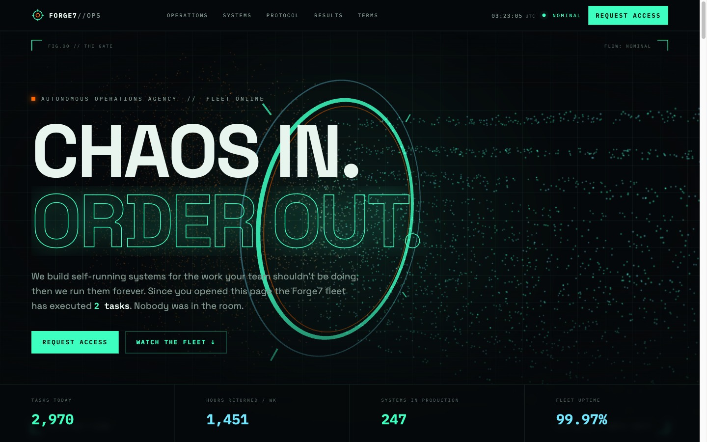

# FORGE7 // Autonomous Operations

> Chaos in. Order out.

A landing page for a fictional AI automation agency, designed as a **living mission-control deck**: instead of claiming automation, the page performs it.

**Live:** https://barakalmog.github.io/forge7-fabel-ui/



## What's inside

- **Boot sequence** - the page types itself online (`> suppressing busywork ... OK`), click to skip
- **The Gate** - a Three.js stream of ~7,000 particles: hot orange turbulence snaps into a cool phosphor lattice as it crosses the ring
- **Live ops feed** - a simulated production console with real timestamps, retries that recover, and `HUMAN INTERVENTIONS TODAY: 0`
- **Seven phases, seven clauses** - sticky radial gauge, self-checking terms, a terminal-styled access request
- Press **`7`** for overdrive

## Design system

Phosphor Ops Deck: void `#05080A`, signal green `#3DFFC0`, data cyan `#71E6FF`, forge heat `#FF6A00`, amber `#FFB454`. Set in Space Grotesk and IBM Plex Mono.

## Run locally

Any static server works; libraries (GSAP, Three.js) are vendored:

```sh
python3 -m http.server 4317
# open http://127.0.0.1:4317/
```

## Notes

- Vanilla JS, no build step. GSAP + ScrollTrigger for choreography, Three.js for the gate.
- Respects `prefers-reduced-motion`, degrades without WebGL, mobile-friendly.
- The first iteration of this page (a Victorian "automaton works" paper aesthetic) lives in [`legacy-paper/`](legacy-paper/).
- FORGE7 is fictional, built to show what a real one should feel like.
